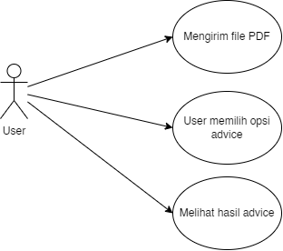
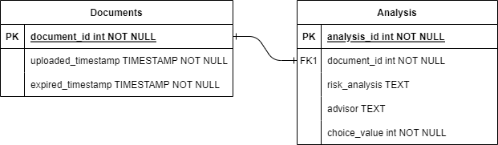
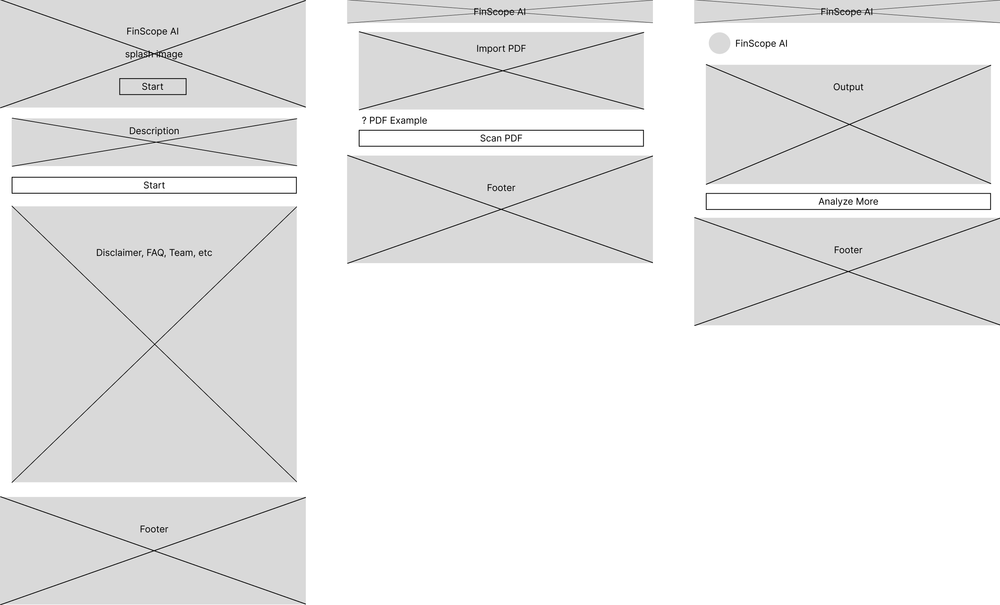
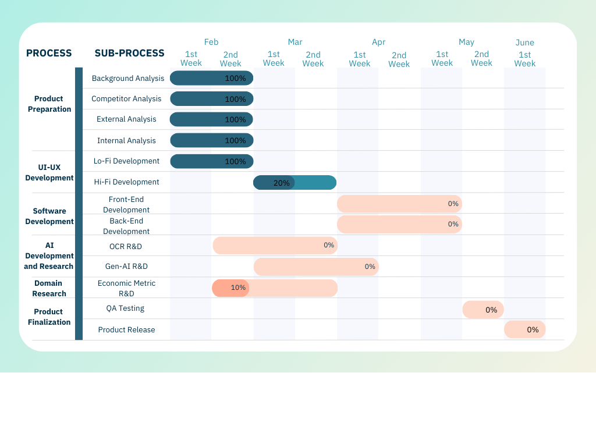

# FinScope-AI - Senior Project  

## MBM-Venture Group  

<ul>
<li>**Anggota 1**: Bintang Restu Bawono - 21/474703/TK/52376   </li>
<li>**Anggota 2**: Muhammad Luthfan Arrayan - 21/479825/TK/52943   </li>
<li>**Anggota 3**: Muhammad AlGhifari Fausta - 21/477892/TK/52646   </li>
</ul>
# Modul 1 - Senior Project

## Instansi :

**Departemen Teknologi Elektro dan Teknologi Informasi, Fakultas Teknik, Universitas Gadjah Mada**  

## Nama Produk : FinScope-AI  

## Jenis Produk : Financial Advisor  

## Latar Belakang :

Investasi merupakan kegiatan untuk mengembangkan dana dengan harapan mendapatkan keuntungan di masa depan. Namun, meskipun investasi menjanjikan potensi imbal asil yang menguntungkan, keberhasilan dalam berinvestasi juga diimbangi dengan risiko yang arus dipahami dengan baik oleh para investor. Sayangnya, pemahaman masyarakat tentang nvestasi masih rendah, bahkan ada yang sama sekali tidak mengerti tentang risiko terkait engan investasi. Hal ini dapat menjadi masalah serius karena ketidakpahaman tersebut dapat enyebabkan para calon investor membuat keputusan yang kurang tepat, bahkan berisiko mengalami kerugian finansial yang signifikan. 
  

## Rumusan Permasalahan :

<ol>
  <li>Stakeholders pada perusahaan yang sama, akan tetapi tidak memahami posisi</li>
  <li>Investor yang tidak memiliki Literasi Finansial yang baik tidak memiliki petunjuk
untuk melakukan analisis secara fundamental terhadap perusahaan terkait.</li>
  <li>Masyarakat yang belum paham terhadap instrumen investasi dan risiko yang
didapatkan ketika ingin melakukan proses investasi.</li>
</ol>

## Ide Solusi :

**Sistem Rekomendasi Kesehatan Keuangan Perusahaan Melalui Analisa Laporan KeuanganBerbasis Large Language Models Dan Optical Character Recognition.**  

| Fitur                | Keterangan                                                                                                                                                                                                                                                                                                           |
| -------------------- | -------------------------------------------------------------------------------------------------------------------------------------------------------------------------------------------------------------------------------------------------------------------------------------------------------------------- |
| Financial Extraction | Pada fitur ini Financial Extraction adalah fitur yang menggunakan teknologi OCR (Optical Character Recognition) untuk melakukan proses ekstraksi dari Data Keuangan Perusahaan (PDF/PNG) sehingga dapat melakukan beberapa call-to-action terhadap data yang sudah di extract dalam bentuk tabular data.             |
| Risk Measurement     | Pada fitur ini, akan diberikan rekomendasi terhadap pengguna untuk proses diversifikasi terhadap instrumen investasi yang ia kehendaki. Pada fitur ini, Risiko akan berbasis terhadap 2 teori ekonomi yaitu Minimum Variance Frontier dan juga Maximum Sharpe Ratio.                                                 |
| Financial Advisor    | Pada fitur ini kami akan menggunakan Large Language Models untuk memberikan rekomendasi terhadap data keuangan yang sudah di extract melalui Financial Extraction, LLM akan memproses informasi tersebut untuk melakukan analisis dan juga rekomendasi apakah perusahaan tersebut sehat secara finansial atau tidak. |

 

## Analisis Kompetitor :  

<table style="width:100%; border-collapse: collapse;" border="1">
  <tr>
    <th colspan="2" style="text-align:center;">Kompetitor 1</th>
  </tr>
  <tr>
    <td>Nama</td>
    <td>Bibit</td>
  </tr>
  <tr>
    <td>Jenis Kompetitor</td>
    <td>Direct/Indirect/Tertiary Competitors</td>
  </tr>
  <tr>
    <td>Jenis Produk</td>
    <td>Robo Advisor (Investment Recommendation)</td>
  </tr>
  <tr>
    <td>Target Customer</td>
    <td>Masyarakat dengan umur 18 - 40 Tahun</td>
  </tr>
  <tr>
    <td>Kelebihan</td>
    <td>
    <ul>
    <li> Segmentasi Investasi yang luas (Saham, Reksadana, Obligasi Pemerintah)</li>
    <li> Memiliki Integrated-System antara Advisor dengan Sekuritas</li>
    </ul>
    </td>
  </tr>
  <tr>
    <td>Kekurangan</td>
    <td>
    <ul>
      <li> Fokus pada Personal Financial</li>
      <li> Tidak memiliki teknologi untuk menganalisis suatu perusahaan secara fundamental </li>
    </ul>
    </td>
  </tr>
  <tr>
    <td>Key Competitive Advantage & Unique Value</td>
    <td>Personalized Investment Decision: Fitur ini akan menyesuaikan rekomendasi berdasarkan preferensi investasi pengguna (Agresif/Menengah/Aman). Hal ini menjadikan aplikasi lebih user friendly dengan mengedepankan fitur personalized.</td>
  </tr>
</table>
 
<table style="width:100%; border-collapse: collapse;" border="1">
  <tr>
    <th colspan="2">KOMPETITOR 2</th>
  </tr>
  <tr>
    <td>Nama</td>
    <td>Stockbit</td>
  </tr>
  <tr>
    <td>Jenis Kompetitor</td>
    <td>Direct/Indirect/Tertiary Competitors</td>
  </tr>
  <tr>
    <td>Jenis Produk</td>
    <td>Personal Financial Advisor</td>
  </tr>
  <tr>
    <td>Target Customer</td>
    <td>Masyarakat dengan umur 18 - 40 Tahun</td>
  </tr>
  <tr>
    <td>Kelebihan</td>
    <td>
      <ul>
        <li>Memiliki Pasar Reksadana yang comprehensive yang terdiri dari Reksadana Pasar Uang, Reksadana Obligasi, Reksadana Campuran dan Saham</li>
        <li>Terdapat Professional tools untuk memudahkan Analisis Technical</li>
      </ul>
    </td>
  </tr>
  <tr>
    <td>Kekurangan</td>
    <td>
      <ul>
        <li>Hanya fokus pada 1 Instrumen perusahaan saja yaitu Reksadana</li>
        <li>Memerlukan Pengetahuan Finansial tingkat Menengah untuk menggunakan Professional Tools & Advisor untuk proses Analisis</li>
      </ul>
    </td>
  </tr>
  <tr>
    <td>Key Competitive Advantage & Unique Value</td>
    <td>Terdepat fitur Financial Goals dan Menabung Rutin: Fitur ini memiliki basis sebagai sistem reminder terhadap user untuk melakukan investasi secara berkala ada aplikasi. Hal ini akan meningkatkan churn rate dan juga meningkatkan customer retention pada saat persamaan.</td>
  </tr>
</table>
 
<table style="width:100%; border-collapse: collapse;" border="1">
  <tr>
    <th colspan="2">KOMPETITOR 3</th>
  </tr>
  <tr>
    <td>Nama</td>
    <td>HaloFin</td>
  </tr>
  <tr>
    <td>Jenis Kompetitor</td>
    <td>Direct/Indirect/Tertiary Competitors</td>
  </tr>
  <tr>
    <td>Jenis Produk</td>
    <td>Financial Advisor</td>
  </tr>
  <tr>
    <td>Target Customer</td>
    <td>Masyarakat dengan umur 18 - 40 Tahun</td>
  </tr>
  <tr>
    <td>Kelebihan</td>
    <td>
      <ul>
        <li>Fully Integrated advisor yang memiliki landscape rekomendasi yang luas.</li>
        <li>Terdapat fitur Forecast untuk melakukan prediksi harga dan juga biaya yang akan dikeluarkan untuk kegiatan tertentu.</li>
      </ul>
    </td>
  </tr>
  <tr>
    <td>Kekurangan</td>
    <td>
      <ul>
        <li>Manual Input pada sistem rekomendasi sehingga memiliki kecenderungan untuk mistype.</li>
      </ul>
    </td>
  </tr>
  <tr>
    <td>Key Competitive Advantage & Unique Value</td>
    <td>Terdepat Life Plan Metric & Cost Forecast : Pada HaloFin, fitur ini merupakan salah satu fitur yang menjadi value proposition dimana Life Plan Metric & Cost Forecast merupakan fitur personalized pada tiap - tiap user. Hal ini mampu meningkatkan positioning HaloFin yang awalnya hanya sebuah advisor menjadi Social Media Investasi untuk pengguna.</td>
  </tr>
</table>

# Modul 2 - Senior Project

## Metodologi SDLC

**Agile Methodology**

## Alasan Penggunaan Metodologi SDLC

Pada penggunaan metodologi Agile, terdapat beberapa keuntungan yang digunakan untuk pengembangan perangkat lunak yaitu adalah sebagai berikut : 
  
<ol>
  <li>Fleksibilitas dan Adaptibilitas --> Terdapat kemungkinan bahwa fitur yang dikembangakan akan berkurang atau bertambah menurut dengan kapabilitas dan juga resource yang digunakan, sehingga agile sangat cocok dengan pengembang environment berbasis Generative AI. </li>
  <li>Meningkatkan Collaboration Rate --> Pada Metode Agile, proses development dapat dilakukan secara bersamaan, sehingga tahap tahap R&D dan juga pengembangan lainnya dapat dilakukan dan didistribusikan secara merata.
  </li>
  <li>Transparent Progress Tracking --> Terdapat progress tracking yang dapat memantau secara komprehensif mengenai perkembangan development dari team developer.
  </li>
</ol>

## Tujuan Produk

Sebagai Financial Advisor yang memiliki business model B2B (Business-to-Business) untuk sebuah perusahaan untuk mengerti kondisi finansial secara menyeluruh. Masyarakat dan pegawai yang memiliki literasi finansial rendah dapat memahami kondisi perusahaan berdasarkan laporan keuangan menggunakan bantuan Generative AI dan OCR.
  

## Pengguna Potensial dari Produk dan Kebutuhan

<ol>
  <li>Gen Z ( 18 - 23 Tahun ) yang ingin memulai analisis secara fundamental pada sebuah perusahaan</li>
  <li>Gen Y ( 24 - 39 Tahun ) yang diduduki oleh usia pemasukan stabil yang ingin menilai perusahaan dari segi performa finansial.</li>
</ol>

## Use Case Diagram

## Functional Requirement

| **FR** | **Deskripsi**                                                |
| ------ | ------------------------------------------------------------ |
| FR-1   | Application must provide user the capability to upload file. |
| FR-2   | Application must provide result visualization.               |
| FR-3   | Application must display warning if something went wrong.    |

## Entity Relationship Diagram

## Low Fidelity Wireframe

## Gantt-Chart Project

